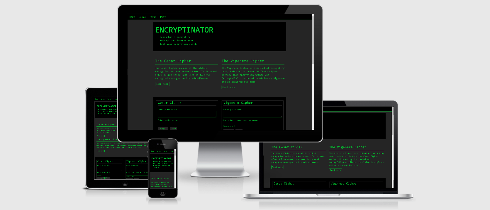
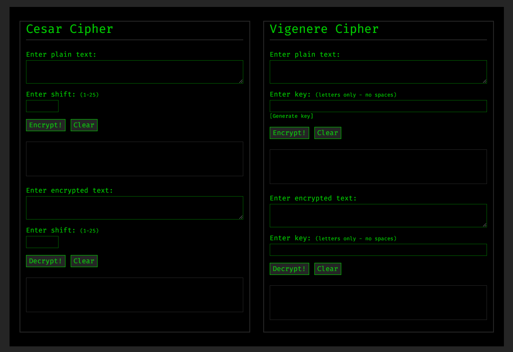

# Encryptinator


[Live website](https://thorole.github.io/encryptinator)

Encryptinator is a command line themed, educational website for people who want to learn basic encryption. Possible users can range
from students of data science all the way down to students in elementary school. This does not exclude any other type of users, of course. Some may simply be interested in the website for the sole purpose of encrypting/decrypting
a message.

 
## UX

### General

The owner of the website recognize the needs for a website that explains the basics of encryption in a non-complex
manner. Its important for the owner that the content of the page is layed out in such a way that it does not
scare off users with too much complexity. The owner also has interests in developing such a site as it easilly
can be used to encrypt/decrypt messages. 

### Typography
The font used for this website was carefully chosen, as it is very important that the font supports the feeling of 
working with the command line. The website uses a font from [Google Fonts'](https://fonts.google.com/) library called [Fira Code](https://fonts.google.com/specimen/Fira+Code?selection.family=Fira+Code&sidebar.open&query=fira+code). This is font that has very much in common with your typical command line font, and most importantly, it's a monotype font. This is the only font used throughout the website, in order to enhance the feeling of a command line interface.

 ### Colors
 The color theme of the website is very simplistic. All text is green, while backgrounds alternate between black and dark grey. Black and grey is very important to provide some variation against the green text. It also serves the purpose of separating the three main parts of the website.

 There are a few instances across the website where a tone of white is used. Most of these instances are for
 text that needs to stand out, like in the learn section and the alternating green/white "start game" button, but also on hover on links in the navbar.

 A tone of orange is used for all error messages in the encryption forms and in the game. 
 

### User Stories


- Upon entering the website, I immediately get the feeling of working with an old computer/command line.

- I want to see a navbar at the top of the screen.

- I want to see a large jumbotron/hero which sums up the most important features of the website. 

- As a learner, I would like to see a section which explains the two encryption/decryption methods used in the website, as well as examples and figures.

- I want to see a section beneath the learning section where I can try to encrypt and decrypt text in an easy way. 

- I would like to see a feature that lets me test what I have learned.

### Wireframes

- [Landingpage top](attachments/wireframelandingtop.pdf) | [mobile](attachments/mobilewireframelandingtop.pdf)
- [Landingpage bottom](attachments/wireframelandingbottom.pdf) | [mobile](attachments/mobilewireframelandingbottom.pdf)
- [Gallery](attachments/wireframegallery.pdf) | [mobile](attachments/mobilewireframegallery.pdf)
- [Contact](attachments/wireframecontact.pdf) | [mobile](attachments/mobilewireframecontact.pdf)


## Features

The website is divided into three main sections, all on the same page. The content is layed out in such a way that a user who has no experience with encryption can read through the learning section at the top, move on to the encryption forms and try it out for themselves, and finally test themselves in a simple game where the goal is to decrypt as many words as possible.   

### Existing Features

## Nav bar and jumbotron


The navbar is custom built with flexbox. It consists of four navigation links which takes the user to the desired sections of the site. All links turn white on hover.

The jumbotron has two purposes. It displays the title of the website, and sumarizes its main features.

## Learning section


This section is part of the meat and potatos of the website. It is key for users without any knowledge of encryption to read through this section in order to understand the other two sections of the website. However, the learning section works fine on its own, and she's/he's not required to try out the later sections.

The learning section features two sub sections, one for each encryption method. Both sub sections have buttons that lets the user expand or collapse it. The main purpose for this is that these sections are relatively long, and being able to collapse them when a user has read through the content makes the website easier to navigate, and visually more tidied.

Each subsection contains information on how encryption works when using Cesar cipher and Vigenere cipher. There are also figures present to aid the user in understanding the concepts. Both figures opens in a modal on click and displays even further explaining and examples. Modals close by either clicking on the close symbol (X) or by clicking anywhere in the window.

## Explore section


In this section the user can try out encrypting/decrypting text on their own. Both forms are built in a similar way. The user enters some text in the appropriate textfield, sets the shift or key, and then click encrypt or decrypt button. If the user don't enter any text in the textfield, or fails to meet the required format of the shift or key, an error message will be displayed over the current input element. This message briefly explains what the user must do to make it right.

The Vigenere Cipher form also sports an option to generate a key. This functionality uses an API to retrieve a random word. The drawback of this functionality is that if you request many words repeatedly, you're timed out for a few seconds. If this happens, the user will also be notified in the same way as explained in the last paragraph. Optionally, in the mean time, the user can just enter their own key instead if they don't wish to wait.

It is also worth mentioning that all input areas are hilighted with a green glow around the borders when focused. There are also "clear" buttons present to quickly clear all the text areas.

## Game


In addition, you may also use this section to discuss plans for additional features to be implemented in the future:

### Features Left to Implement
- The artists behind Dragons's Den are also hosting workshops for people who want to learn to design
their own art. In the feature there will be a page dedicated to a schedule of these workshops.

- The gallery will be divided into more sections: Characters, cities, maps etc.

- Fixed price packages. For instance: 4 character designs, 1 world map, 1 city map - 100$.

## Technologies Used

- [Gitpod](https://gitpod.io/)
- The project is written in [HTML5](https://www.w3.org/) and [CSS3](https://www.w3.org/)
- [Fontawesome](https://fontawesome.com/)
- [Bootstrap](https://www.getbootstrap.com) - The project uses bootstrap for large parts of the layout.
- [Google Fonts](https://fonts.google.com/)
- The project uses JavaScript from [w3schools](https://www.w3schools.com/howto/howto_css_modal_images.asp) in the gallery section to make
images display in modal when clicked. Some of the script was modified by the author of Dragon's Den Designs
to fit the project.
- [Free Formatter](https://www.freeformatter.com/)

  - ***Note:*** *During development, Gitpod's format function was buggy so the code had to be externally formatted
and pasted back into gitpod. This resulted in poor indentation in the first two thirds of the commits.* 


## Testing

In addition to the manual tests beneath, the site has also been tested by other users on Code Institute's Slack room. One 
bug was reported where the user was able to send text through the phone input on the contact page. This error has been fixed.

#### Landing-page
- Clicked all links in navbar, including brand, to make sure the user is directed to the correct section/page: success
- Clicked contact link at bottom of landing page to make sure user is directed to contact page: success
- Clicked contact link at bottom of landing page to make sure user is directed to contact page: success
- Clicked "back to top" link at bottom of landing page to make sure user is directed to top of landing page: success.
- Clicked social media links to check if user is directed to correct social media network: success
- Redused screen size to check that page displays in single column on smaller screens: success

#### Gallery
- Clicked all links in navbar, including brand, to make sure the user is directed to the correct section/page: success
- Clicked all images to make sure they open in modal: success
- Modal closes by clicking anywhere on modal: success
- Redused screen size to make sure gallery displays in two columns instead of four columns on smaller screens: success
- Clicked social media links to check if user is directed to correct social media network: success

#### Contact page
- Clicked all links in navbar, including brand, to make sure the user is directed to the correct section/page: success
- If you try to submit without a valid e-mail address and without input in required fields, there 
    should pop up a message telling the user what's missing: success
- Clicked social media links to check if user is directed to correct social media network: success


### Testing and Responsiveness across browsers and devices
The website was built and tested in Chrome throughout the construction. In addition it has been tested
in Mozilla Firefox, MS Edge and Mac OS Safari. The website is responsive as intended across
all browsers used in testing.

The website has also been tested physically on iPhone S, ipad 2nd gen., iPhone 7 and Mi a2 Redmi note 7.
The website responds well to smaller screen sizes and no major problems have appeared. The intention
is that on medium to small screens the website is layed out in a single column 
(except for the gallery), which it does. During construction the site was constantly tested on phone sized
screen in the Chrome dev. tools to make sure it looked good and behaved as intended.

#### Tools used in testing
- [W3C Markup Validation](https://validator.w3.org/) (30 errors in bootstrap css, 0 errors in html and local style.css) 

- [Accessibility checker](https://www.achecker.ca)
    - 5 problems concerning use of ```<i>``` element (used for fontawsome) The checker suggests using ```<em>``` or ```<strong>```.
      - *Font awsome recommends using the ```<i>``` element for their icons. Font awesome's [guidelines for accessibility](https://fontawesome.com/how-to-use/on-the-web/other-topics/accessibility)
      has been followed to make all font awesome icons accessible.*  
    - Potential problems concerning  elements and ```alt=""``` description being too short. 
      - *All images have ```alt=""``` descriptions. None of the images are semantically important.*
- [Autoprefixer](https://autoprefixer.github.io/)
- [Chrome DevTools](https://developers.google.com/web/tools/chrome-devtools)

## Deployment

**I followed this procedure to deploy Dragon's Den**

1. Navigate to the [repository](https://github.com/thorole/dragonsden)
2. Select [Branch: master]
3. Go to settings
4. Scroll down to "Github Pages". Make sure the repo is set to public in "Danger Zone"-section beneath. 
5. Select [master branch] 
6. Refresh setting page and scroll down to "Github pages" to view the live website URL.

**To clone the repository, follow these instructions:**

1. Navigate to the [repository](https://github.com/thorole/dragonsden)
2. Click **Clone or download**
3. Copy the url from the **Clone or download** dropdown.
4. In cli, navigate to the folder where you want to clone the repository.
5. Type *git clone*, and then paste the URL you copied in Step 3.
6. Press Enter 

For more information, visit [Cloning a repository](https://help.github.com/en/github/creating-cloning-and-archiving-repositories/cloning-a-repository)
on github.

## Credits

### Content
- The function that makes images open in modal when clicked was copied from [w3schools](https://www.w3schools.com/howto/howto_css_modal_images.asp).
- Template for navigation bar copied from [Bootstrap website](https://getbootstrap.com/docs/4.0/components/navbar/)
### Media
- Most of the images on the site, including the hero image was taken from [Pixabay](https://www.pixabay.com) and [wallpaperflare](https://www.wallpaperflare.com)
- Some images also taken from [HD wallpapers](https://www.hdwallpapers.net)
- The dragon icon and favicon was taken from [FreeIconsPng](https://www.freeiconspng.com)


### Acknowledgements

This site inspired some of Dragon's Den's layout:
https://www.unicef.org/child-rights-convention 
